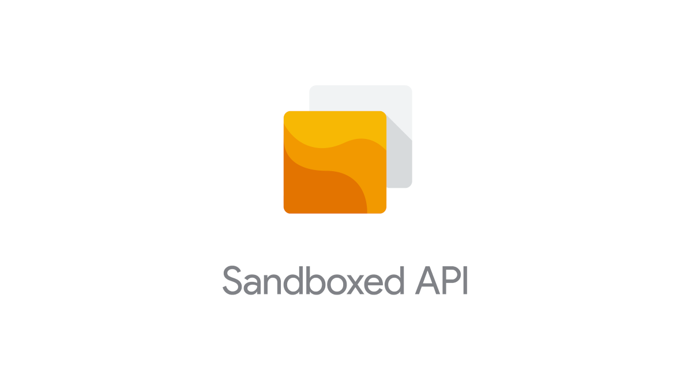

Copyright 2019-2022 Google LLC

## What is Sandboxed API?

The Sandboxed API project (**SAPI**) makes sandboxing of C/C++ libraries less
burdensome: after initial setup of security policies and generation of library
interfaces, a stub API is generated, transparently forwarding calls using a
custom RPC layer to the real library running inside a sandboxed environment.

Additionally, each SAPI library utilizes a tightly defined security policy, in
contrast to the typical sandboxed project, where security policies must cover
the total syscall/resource footprint of all its libraries.

## Documentation

Developer documentation is available on the Google Developers site for
[Sandboxed API](https://developers.google.com/code-sandboxing/sandboxed-api).

There is also a
[Getting Started](https://developers.google.com/code-sandboxing/sandboxed-api/getting-started)
guide.

## Getting Involved

If you want to contribute, please read [CONTRIBUTING.md](CONTRIBUTING.md) and
send us pull requests. You can also report bugs or file feature requests.

If you'd like to talk to the developers or get notified about major product
updates, you may want to subscribe to our
[mailing list](mailto:sandboxed-api-users@googlegroups.com) or sign up with this
[link](https://groups.google.com/forum/#!forum/sandboxed-api-users).
