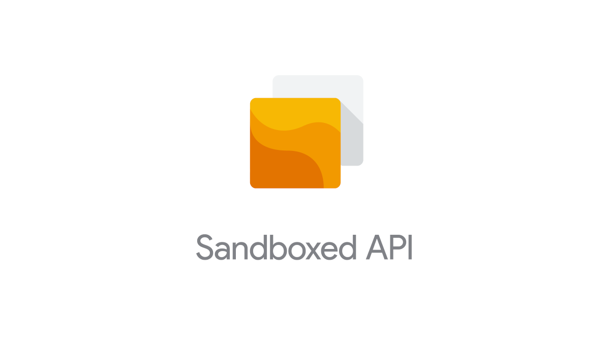

<p align="left">
  
  
</p>
<p align="center">
  
</p>

Copyright 2019-2026 Google LLC

### Introduction

The open-source Sandboxed API (SAPI) project builds on top of Google's
[Sandbox2](https://developers.google.com/code-sandboxing/sandbox2) and
aims to make sandboxing of C/C++ libraries less burdensome.

Sandboxed API provides three main benefits:

*   Instead of sandboxing entire programs or having to change source code to be
    able to sandbox a part of a program as with Sandbox2, individual C/C++
    libraries can be sandboxed with SAPI. As a result, the main program is
    isolated from code execution vulnerabilities in the C/C++ library.

*   Our working motto is: Sandbox once, use anywhere. Libraries sandboxed with
    Sandboxed API can be reused easily, which removes the burden for future
    projects. Before Sandboxed API, sandboxes available for use at Google
    required additional implementation work with each new instance of a project
    which was intended to be sandboxed, even if it reused the same software
    library. Sandbox2 policies and other restrictions applied to the sandboxed
    process had to be reimplemented each time, and data exchange mechanisms
    between trusted and untrusted parts of the code had to be designed from
    scratch.

*   Each SAPI library utilizes a tightly defined security policy, in contrast
    to the typical sandboxed project, where security policies must cover the
    total syscall/resource footprint of all utilized libraries.

Sandboxed API (SAPI) has been designed, developed, and is maintained by members
of the Google Sandbox Team. It also uses our field-tested Sandbox2. Currently,
many internal projects are using SAPI to isolate their production workloads.

Sandbox2 is also open-sourced as part of the SAPI project and can be used
independently.

### Documentation

Developer documentation is available at [Sandboxed API](https://developers.google.com/code-sandboxing/sandboxed-api)
and [Sandbox2](https://developers.google.com/code-sandboxing/sandbox2).

We recommend reading [SAPI Getting Started](https://developers.google.com/code-sandboxing/sandboxed-api/getting-started)
guide, or [Sandbox2 Getting Started](https://developers.google.com/code-sandboxing/sandbox2/full-getting-started)
respectively.

If you are interested in a general overview of sandboxing technologies, see
https://developers.google.com/code-sandboxing.

### Dependencies

SAPI and Sandbox2 both support Bazel and CMake build systems. The following
dependencies are required on Debian 13 ("Trixie"):

```bash
sudo apt-get update
sudo apt-get install -qy --no-install-recommends \
      build-essential \
      clang-19 \
      git \
      gnupg \
      libcap-dev \
      libclang-19-dev \
      libclang-rt-19-dev \
      libncurses-dev \
      libzstd-dev \
      linux-libc-dev \
      llvm-19-dev \
      pkg-config \
      unzip \
      wget \
      zip \
      zlib1g-dev
# Bazel only, check https://bazel.build/install/ubuntu for details
sudo apt-get install -qy --no-install-recommends \
      bazel \
      openjdk-17-jdk-headless
# CMake only
sudo apt-get install -qy --no-install-recommends \
      cmake \
      ninja-build
```

#### LLVM

SAPI offers a clang tool header generator based on
[LLVM Libtooling](tools/clang_generator/BUILD).

We aim to provide support for at least the latest three LLVM releases and
test on Debian stable.

### Getting Involved

If you want to contribute, please read [CONTRIBUTING.md](CONTRIBUTING.md) and
send us pull requests. You can also report bugs or file feature requests.

If you'd like to talk to the developers or get notified about major product
updates, you may want to subscribe to our
[mailing list](mailto:sandboxed-api-users@googlegroups.com) or sign up with this
[link](https://groups.google.com/forum/#!forum/sandboxed-api-users).
