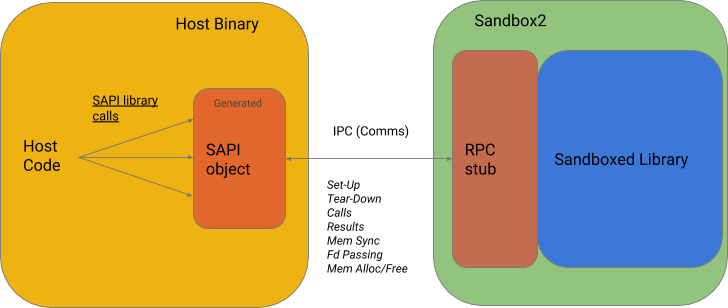

# How it works

## Overview

The Sandboxed API project allows to run code of libraries in a sandboxed
environment, isolated with the help of [Sandbox2](../sandbox2/README.md).

Our goal is to provide developers with tools to prepare such libraries for the
sandboxing process, as well as necessary APIs to communicate (i.e. make function
calls and receive results) with such library.

All calls to the sandboxed library are passed over our custom RPC implementation
to a sandboxed process, and the results are passed back to the caller.

The project also provides [primitives](variables.md) for manual and
automatic (based on custom pointer attributes) memory synchronization (arrays,
structures) between the SAPI Libraries and the host code.

A [high-level Transactions API](transactions.md) provides monitoring of SAPI
Libraries, and restarts them if they fail (e.g, due to security violations,
crashes or resource exhaustion).

## Getting startd

Read our [Get Started](getting-started.md) page to set up your first Sandboxed
API project.
